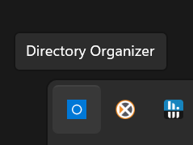
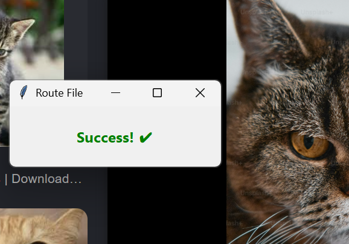

markdown_content = """# 🗂️ Smart Directory Organizer

A lightweight, highly resilient Windows background daemon that intercepts internet downloads in real-time and allows you to instantly route them to custom categories. 

Built with **Python**, **Watchdog**, and **Tkinter**, this app utilizes advanced Windows Alternate Data Streams (ADS) and a thread-safe Producer-Consumer architecture to guarantee 100% accurate download detection without annoying false positives.

---

## ✨ Key Features
* **🎯 True Download Detection:** Uses Windows NTFS Alternate Data Streams (`ZoneId=3`) to strictly identify actual internet downloads. Ignores local file edits, browser "ghost files" (`.crdownload`), and internal file movements.
* **🛡️ Stateless & Resilient:** Employs a hybrid state architecture. Uses short-term session caches to absorb antivirus scan echoes, and relies on stateless OS timestamps (`getctime`) and custom invisible watermarks (`:OrganizerTag`) for bulletproof long-term tracking.
* **⚡ Non-Blocking UI:** Runs the file system observer on a background daemon thread while safely passing events to the main Tkinter UI thread via a thread-safe Queue.
* **⚙️ Custom Routing:** Easily map destination folders to quick-click categories.

---

## 💡 Use Cases
* **🎓 Students:** Instantly route downloaded syllabi, lecture slides, and assignments to specific class folders.
* **🎨 Designers & Video Editors:** Sort downloaded assets (images, fonts, sound effects, overlays) into project-specific directories the second they finish downloading.
* **💻 Developers:** Separate downloaded datasets, documentation, and executable tools without manually dragging and dropping from the `Downloads` folder.

---

## 📖 How to Use

### 1. Setup & Configuration
The application runs quietly in the background. You can access the controls via the system tray or main menu. 

First, add the folders you want the app to watch (e.g., your default Windows `Downloads` folder).
 

Next, create your custom routing categories. Give the category a name and select its final destination folder.
 

### 2. Download a File
Go about your normal workflow. Whenever you download a file from the internet (via Chrome, Edge, Firefox, etc.), the background daemon is watching.

### 3. Instant Routing
The exact moment the download completes (and passes the strict verification gauntlet to ensure it's a real download), a sleek, non-intrusive UI pops up. 

Simply click the category you want to send the file to.

[//]: # ( )

[//]: # (![Selecting Category]&#40;src/Screenshot%20&#40;15&#41;.png&#41;)

### 4. Success!
The file is instantly moved to your destination, keeping your Downloads folder perfectly clean.

---

## 🛠️ Technical Architecture

This project was built to solve the notoriously chaotic nature of file system events (where a single file download can trigger dozens of OS-level creation, modification, and deletion events).

* **The Producer-Consumer Pattern:** `Tkinter` (UI) and `Watchdog` (File System Monitor) are fundamentally incompatible on the same thread. Watchdog runs on a daemon thread acting as the Producer, strictly filtering events and dropping validated file paths into a `queue.Queue()`. The Tkinter Main Thread asynchronously polls this queue (Consumer) to trigger the UI, preventing thread lockups.
* **Deep OS Forensics:** Instead of relying on unreliable file extensions, the app reads the hidden `Zone.Identifier` text stream attached by Windows to verify the file's origin.
* **Event Debouncing:** Handles "Antivirus Double-Taps" (where Windows Defender locks and modifies a file after downloading) using an ephemeral Session Set alongside a 3-second shield to absorb event echoes.

---

## 🚀 Installation & Running
1. Clone the repository: `git clone https://github.com/rhutshab/directory-organizer.git`
2. Install dependencies: `pip install watchdog`
3. Run the application: `python main.pyw` (using `.pyw` ensures it runs in the background without a persistent console window).
"""